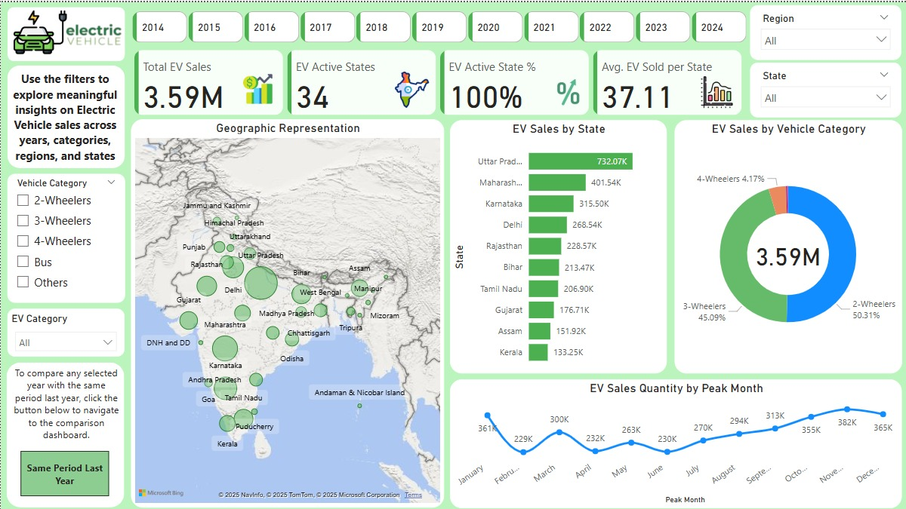

# 🚗 Electric Vehicle Sales Dashboard (India) - Power BI Project

This project is a comprehensive analysis and interactive dashboard built using **Power BI** to visualize **Electric Vehicle (EV)** sales across **Indian states and regions** from **2014 to 2024**. The data was cleaned and transformed using **Python (Jupyter Lab)** and enhanced further in Power BI using **custom DAX measures**, calculated columns, and **region-based grouping**.



---

## 📌 Objective

To analyze and showcase the growth, adoption trends, regional insights, and segment-based performance of electric vehicles in India using interactive and insightful Power BI visualizations.

---

## 📊 Dashboard Highlights

### ✅ **Key KPIs**
- **Total EV Sales** (All-time)
- **EV Active States**
- **EV Market Coverage (%)**
- **Average EVs Sold per State**

### 📈 **Time-Series Trends**
- EV Sales from **2014–2024**
- Peak month patterns (seasonal trends)

### 🗺️ **State & Region Insights**
- State-wise EV adoption (Map & Bar chart)
- Region-wise grouping for simplified insights
- Top performing and lagging regions

### 🚙 **Vehicle Segment Analysis**
- Sales by:
  - 2-Wheelers
  - 3-Wheelers
  - 4-Wheelers
  - Buses
  - Others
- Segment performance over time
- Share of EV categories (Personal, Shared, Goods, Institutional)

---

## 🛠️ Tools & Technologies

| Tool              | Purpose                                   |
|-------------------|-------------------------------------------|
| **Power BI**      | Dashboard creation, DAX calculations      |
| **Python (Jupyter Lab)** | Data cleaning and preprocessing       |
| **Power Query (M)**| Data transformation in Power BI          |
| **DAX**           | Custom KPIs, time intelligence             |

---

## 🧹 Data Cleaning Steps (Python)

Performed in **Jupyter Lab**, the following steps were completed:
- Removed nulls, duplicates
- Standardized column formats
- Converted date column to datetime
- Created new columns:
  - `Month`, `Year`, `MonthNum`
  - Cleaned `Vehicle_Type` and mapped to `Vehicle_Segment`
  - Mapped `EV_Category` from vehicle type

---

## 🔄 Custom Columns Created in Power BI

### 🧭 Region Mapping
Grouped states into zones:
```powerquery
= if [State] = "Andhra Pradesh" or [State] = "Karnataka" ... then "South"
else if ... then "North"
else "Other"
```

### 🏁 EV_Sales_Flag
```powerquery
= if [EV_Sales_Quantity] > 0 then 1 else 0
```

### 🚘 Vehicle_Segment
```powerquery
= if Text.StartsWith([Vehicle_Type], "2W") then "2W"
else if Text.StartsWith([Vehicle_Type], "3W") then "3W"
...
```

---

## 📐 DAX Measures Used

```DAX
Total EV Sales = SUM('Cleaned_Electric_Vehicle_Sales'[EV_Sales_Quantity])

EV Sales This Year = 
CALCULATE([Total EV Sales], 
YEAR('Cleaned_Electric_Vehicle_Sales'[Date]) = YEAR(TODAY()))

EV Active States = 
CALCULATE(DISTINCTCOUNT('Cleaned_Electric_Vehicle_Sales'[State]), 
'Cleaned_Electric_Vehicle_Sales'[EV_Sales_Flag] = 1)

EV Active % = 
DIVIDE([EV Active States], DISTINCTCOUNT('Cleaned_Electric_Vehicle_Sales'[State]), 0)

```

---

## 📁 File Structure

```bash
├── PowerBI_Dashboard.pbix       # Power BI dashboard file
├── data/
│   └── Cleaned_Electric_Vehicle_Sales.csv
├── images/
│   ├── dashboard_main.png
│   └── dashboard_compare.png
├── notebooks/
│   └── Cleaning_data.ipynb      # Jupyter Notebook for cleaning
└── README.md
```

---

## 🎯 Key Insights

- ✅ EV sales have grown steadily over the years, peaking in recent years.
- 🔝 Uttar Pradesh, Maharashtra, and Karnataka are top-performing states.
- 🌍 Southern India leads in EV adoption, followed by the North.
- 📉 Low penetration in Union Territories and North-East regions.
- 🚀 2-Wheelers dominate the EV segment with over 50% share.
- 📊 Seasonal spikes observed in festive and fiscal year-end months.

---

## 🧑‍💼 Project Role

This is my **Second project** as a **Data Analyst Intern at Unifies Company**, where I worked on:
- Cleaning EV data using Python
- Creating interactive reports in Power BI
- Deriving actionable business insights
- Designing the dashboard for real-world stakeholders

---

## 🔗 Connect with Me

- 📧 [Your Email]
- 🌐 [LinkedIn Profile](https://www.linkedin.com/in/ritesh-zambare-0265032b0/)
- 🐙 [GitHub Profile](https://github.com/Riteshhh04)

---

## 📎 License

This project is for educational and portfolio purposes only. Data is publicly sourced.
